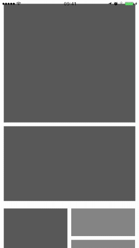

# CollectionViewMultiColumnLayout

**CollectionViewMultiColumnLayout** is a `UICollectionViewLayout` that resembles a tiled waterfall/mosaic layout (as seen all over the web), with support of multiple columns per section and explicitly assigning a section's items to specific columns:



## Usage

```swift
import CollectionViewMultiColumnLayout

class CollectionViewController: UICollectionViewController {

    // ...
    
    override func viewDidLoad() {
        super.viewDidLoad()
        let layout = CollectionViewMultiColumnLayout()
        collectionView.setCollectionViewLayout(layout, animated: false)
    }
}

extension CollectionViewController: CollectionViewMultiColumnLayoutDataSource {

    func collectionView(_ collectionView: UICollectionView, numberOfColumnsInSection section: Int) -> Int {
        // ...
    }

    func collectionView(_ collectionView: UICollectionView, columnForItemAt indexPath: NSIndexPath) -> Int? {
        // ...
    }
}

extension CollectionViewController: CollectionViewMultiColumnLayoutDelegate {

    func collectionView(_ collectionView: UICollectionView, layout: UICollectionViewLayout, sizeForItemAtIndexPath indexPath: NSIndexPath) -> CGSize {
        // ...
    }
    
    // Optional methods:
    
    func collectionView(_ collectionView: UICollectionView, layout: UICollectionViewLayout, heightForHeaderInSection section: Int) -> CGFloat {
        // ...
    }

    func collectionView(_ collectionView: UICollectionView, layout: UICollectionViewLayout, heightForFooterInSection section: Int) -> CGFloat {
        // ...
    }

    func collectionView(_ collectionView: UICollectionView, layout: UICollectionViewLayout, insetForSection section: Int) -> UIEdgeInsets {
        // ...
    }

    func collectionView(_ collectionView: UICollectionView, layout: UICollectionViewLayout, insetForHeaderInSection section: Int) -> UIEdgeInsets {
        // ...
    }
    
    func collectionView(_ collectionView: UICollectionView, layout: UICollectionViewLayout, insetForFooterInSection section: Int) -> UIEdgeInsets {
        // ...
    }
    
    func collectionView(_ collectionView: UICollectionView, layout: UICollectionViewLayout, minimumInteritemSpacingForSection section: Int) -> CGFloat {
        // ...
    }
}
```

## Installation

The recommended way to add **CollectionViewMultiColumnLayout** to your project is via [Carthage](https://github.com/Carthage/Carthage):

    github 'regexident/CollectionViewMultiColumnLayout'

## License

**CollectionViewMultiColumnLayout** is available under the **MPL-2 license**. See the `LICENSE` file for more info.
